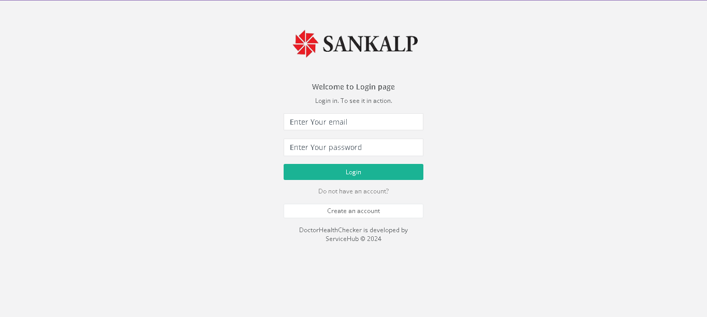
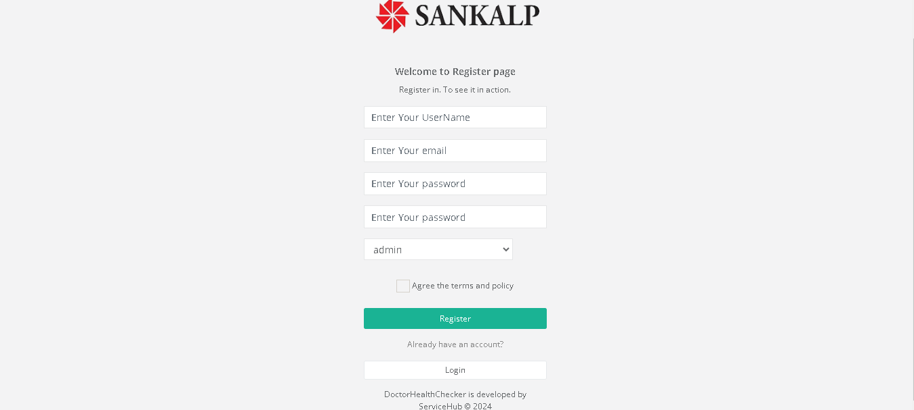
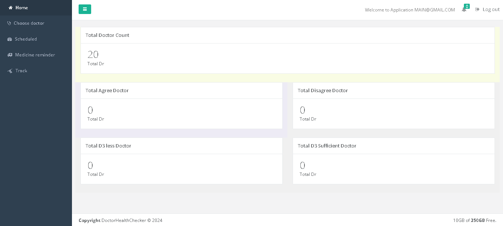
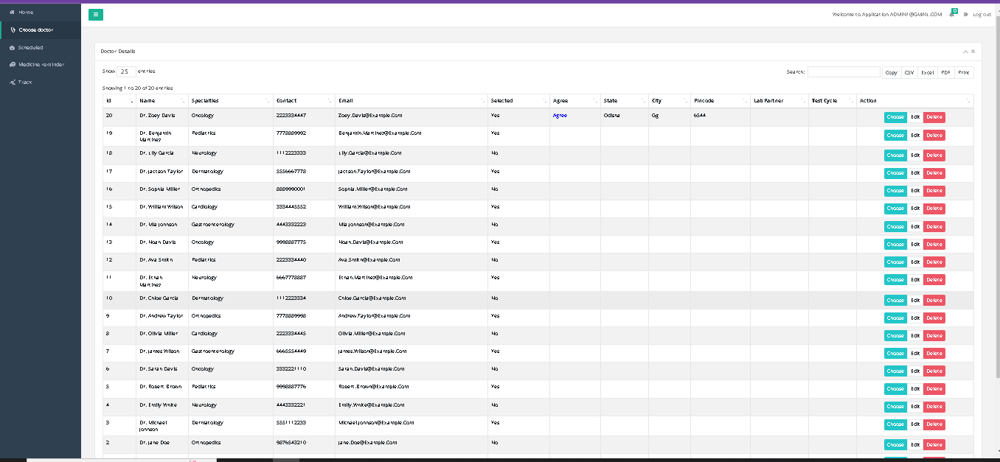
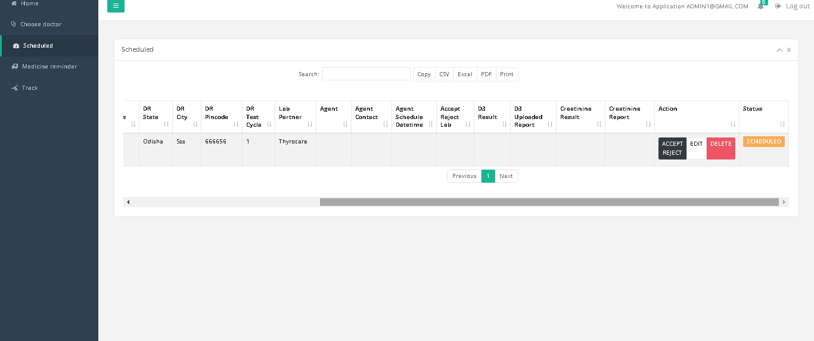

# DoctorHealthChecker: Comprehensive Health Management System

DoctorHealthChecker is a comprehensive health management system developed for Somaya Hospital. The system is designed to cater to multiple roles, including admin, Mr, Pythokind, Thyrocare, and manager. It provides functionalities such as scheduling doctor appointments, medical reminders, tracking doctor activities, and managing test results. The project is deployed on Somaya Hospital's internal server using Laravel.








## About the Project

- **Purpose**: To enhance the efficiency of health management and ensure timely medication and test monitoring for doctors.
- **Technology Stack**: Laravel, MySQL, WhatsApp API, CSRF tokens, Laravel throttling, and secure communication channels.
- **Roles**:
  - **Admin**: Manage system settings and user roles.
  - **Mr**: Send medical reminders and monitor doctor activities.
  - **Pythokind**: Upload test results and manage test data.
  - **Thyrocare**: Upload and manage test results.
  - **Manager**: Oversee doctor activities and test schedules.

## Key Features

- **Role-Based Access Control**: Designed roles and permissions for different users.
- **API for Vitamin Tests**: Implemented APIs to identify required vitamin tests for doctors.
- **Medication Reminders**: Automated SMS notifications via WhatsApp API to remind doctors of medication intake at specified times.
- **Secure Test Result Upload**: Pythokind and Thyrocare can securely upload doctor test results.
- **Medical Reminders**: Mr can send medical reminders to doctors based on test results.
- **Activity Tracking**: Implemented tracking mechanisms to monitor doctors' activities and scheduled tests.
- **Enhanced Security**: Login feature with Laravel throttling rate limiting and CSRF tokens for secure authentication.

## Technologies Used

- **Backend**: Laravel
- **Database**: MySQL
- **APIs**: WhatsApp API for SMS notifications
- **Security**: CSRF tokens, Laravel throttling

## Project Structure

- **app/**: Contains the core application files.
- **public/**: Publicly accessible files, such as images, JavaScript, and CSS.
- **resources/**: Views and frontend assets.
- **routes/**: Application routes.
- **storage/**: Log files and other storage.
- **tests/**: Automated tests.

## Installation

1. **Clone the Repository**

   ```bash
   git clone https://github.com/yourusername/doctor-health-checker.git
